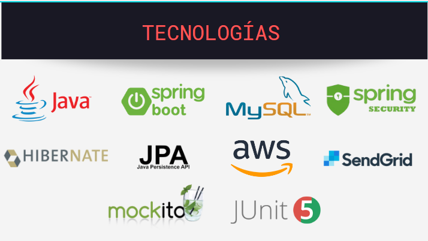

# Proyecto ONG Somos Más

Es un proyecto tipo API REST para una ONG donde se nos solicito realiza el backend de un sitio web que sea su carta de presentación para su organización, donde puedan compartir novedades con la comunidad, contar sobre el trabajo que llevan a cabo, etc.

# Tecnologías

# Integrates 
 - Celeste Miranda
 - Emanuel Sceppaquercia
 - Franco Frigerio
 - Giuliano Monti
 - Jorge Villordo
 - Matias Cabral
 - Miguel Condori
 - Sergio Lewczuk

